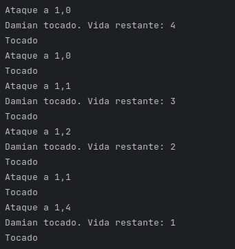

Clase Juego:

# class Juego:
    def __init__(self):
        self.tablero = Tablero()
        self.lanzar_ataque(1, 0)
        self.lanzar_ataque(1, 0)
        self.lanzar_ataque(1, 1)
        self.lanzar_ataque(1, 2)
        self.lanzar_ataque(1, 1)
        self.lanzar_ataque(1, 4)

En el innit se crea el tablero y se lanzan los ataques al tablero.

# Funciones
    def mostrar_resultado(self, resultado):
        if resultado == 0:
            print("Agua")
        elif resultado == 1:
            print("Tocado")
        elif resultado == 2:
            print("Hundido")

    def lanzar_ataque(self, x, y):
        print(f"Ataque a {x},{y}")
        casilla = self.tablero.casillero[x][y]

        resultado = casilla.recibir_disparo()

        self.mostrar_resultado(resultado)
Aqui estan las funciones mostrar_resultado que a partir de 0,1,2 devolvera agua,tocado,hundido
Y la funcion lanzar_ataque la cual sirve para lanzar un ataque a una casilla.

#    Clase tablero
    def __init__(self, tamanho=10):

        self.AGUA = 0
        self.TOCADO = 1
        self.HUNDIDO = 2
        por1 = Nave("Damian", "portaaviones", 5)
        fra1 = Nave("Commit", "fragata", 3)
        fra2 = Nave("Push", "fragata", 3)
        fra3 = Nave("Un10plis", "fragata", 3)

        sub1 = Nave("U-47", "submarino", 1)
        sub2 = Nave("U-96", "submarino", 1)
        sub3 = Nave("U-505", "submarino", 1)
        sub4 = Nave("U-534", "submarino", 1)

        self.casillero = [

            [Casilla('agua'), Casilla('agua'), Casilla('agua'), Casilla('agua'), Casilla('agua'),Casilla('agua'), Casilla('agua'), Casilla('agua'), Casilla('agua'), Casilla('agua')],
            [Casilla(por1), Casilla(por1), Casilla(por1), Casilla(por1), Casilla(por1),Casilla('agua'), Casilla('agua'), Casilla('agua'), Casilla('agua'), Casilla('agua')],
            [Casilla('agua'), Casilla('agua'), Casilla('agua'), Casilla('agua'), Casilla('agua'),Casilla('agua'), Casilla('agua'), Casilla('agua'), Casilla('agua'), Casilla('agua')],
            [Casilla(fra1), Casilla(fra1), Casilla(fra1),Casilla('agua'), Casilla('agua'), Casilla('agua'), Casilla('agua'), Casilla('agua'),Casilla('agua'), Casilla('agua')],
            [Casilla('agua'), Casilla('agua'), Casilla('agua'), Casilla('agua'), Casilla(sub1),Casilla('agua'), Casilla('agua'), Casilla('agua'), Casilla('agua'), Casilla('agua')],
            [Casilla(fra2), Casilla(fra2), Casilla(fra2),Casilla('agua'), Casilla('agua'), Casilla('agua'), Casilla('agua'), Casilla('agua'), Casilla('agua'), Casilla('agua')],
            [Casilla('agua'), Casilla('agua'), Casilla('agua'), Casilla('agua'), Casilla('agua'), Casilla('agua'), Casilla('agua'), Casilla('agua'), Casilla('agua'), Casilla('agua')],
            [Casilla(fra3), Casilla(fra3), Casilla(fra3), Casilla('agua'), Casilla('agua'), Casilla(sub3), Casilla('agua'), Casilla('agua'), Casilla('agua'), Casilla('agua')],
            [Casilla('agua'), Casilla('agua'), Casilla('agua'), Casilla('agua'), Casilla('agua'), Casilla('agua'), Casilla('agua'), Casilla('agua'), Casilla('agua'), Casilla('agua')],
            [Casilla('agua'), Casilla('agua'), Casilla('agua'), Casilla('agua'), Casilla(sub4), Casilla('agua'), Casilla('agua'), Casilla('agua'), Casilla('agua'), Casilla(sub2)]
        ]
Esta clase simplemente se utiliza para crear las naves, crear el tablero y poner cada nave en su respectivo lugar.

# Clase casilla

     def __init__(self, nave):
        self.nave = nave
        self.disparada = False

    def recibir_disparo(self):
        # Si la casilla ya fue atacada antes, no tocamos la nave
        if self.disparada:
            if self.nave == 'agua':
                return 0  # Sigue siendo agua
            else:
                # Si era un barco, devolvemos su estado actual (tocado o hundido)
                # pero SIN restarle vida de nuevo.
                return 2 if self.nave.hundido else 1

        # Si es la primera vez que se dispara a esta casilla:
        self.disparada = True
        if self.nave == 'agua':
            return 0
        else:
            # Solo aquí llamamos al método de la nave para restar vida
            return self.nave.recibir_disparo()

En esta clase tenemos por una parte el innit y recibir_disparo, en la primera simplemente crea un objeto nave (apartir de la nave de tablero) 
y pone que cada casilla no a sido disparada, en recibir-disparo comprueba si en esa casilla ya han disparado y si
en esa casilla hay agua, en ambos casos devuelve 0 (agua).
si hay una nave que no le ha dado todavia llama a recibir_disparo (de nave).

# Clase Nave
        def __init__(self, nombre, tipo, vida):
        self.nombre = nombre
        self.tipo = tipo
        self.vida = vida
        self.hundido = False
        self.TOCADO = 1
        self.HUNDIDO = 2

    def recibir_disparo(self):
        if self.hundido:
            return self.HUNDIDO

        self.vida -= 1
        if self.vida <= 0:
            self.hundido = True
            print(f"{self.nombre} hundido")
            return self.HUNDIDO
        else:
            print(f"{self.nombre} tocado. Vida restante: {self.vida}")
            return self.TOCADO
En esta clase esta el innit y el recibir_disparo, en el innit se comprueban todos los atributos de nave para que todo
este bien, en recibir_disparo se le baja 1 de vida a la nave y dependiendo de la vida restante pone o tocado o hundido
si es 0 hundido si es 1 o mas tocado.

Comprobacion

